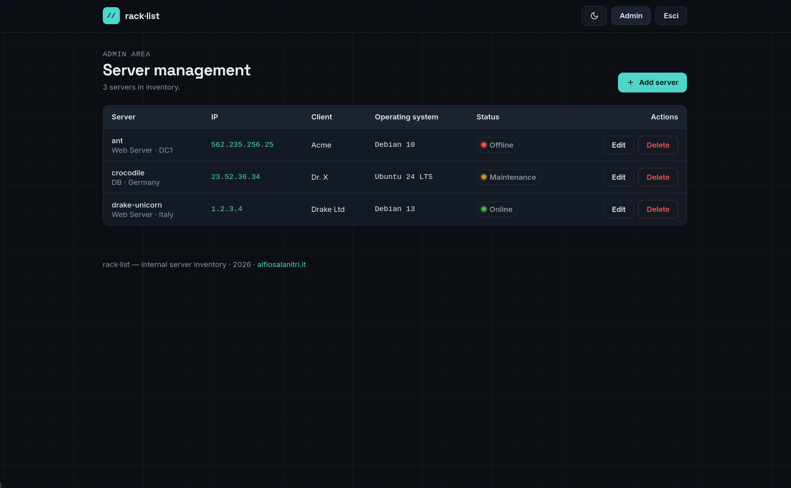
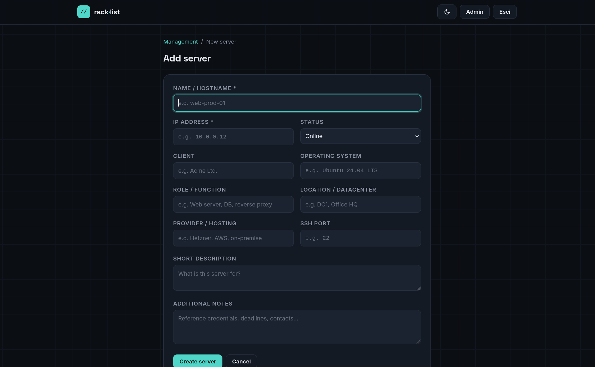
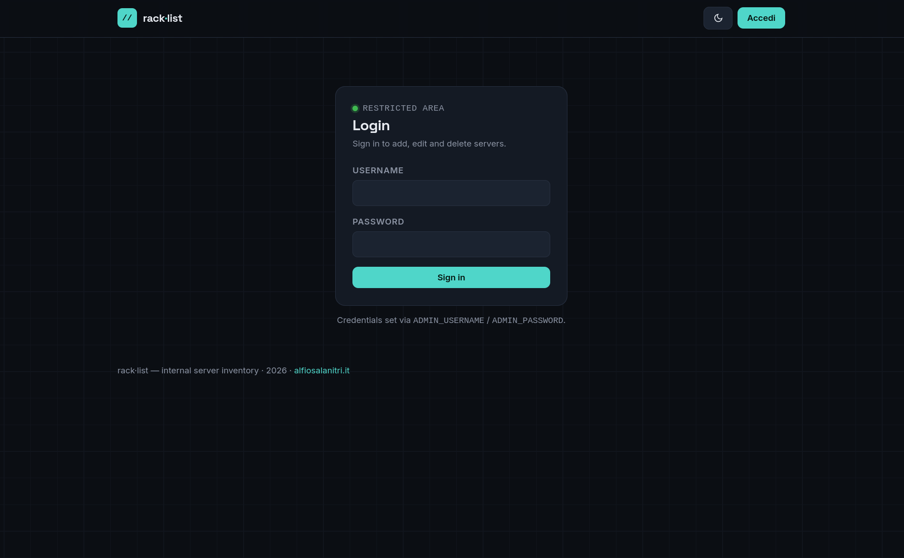

# rack·list — Server Inventory

A lightweight Flask + Tailwind app to catalogue your servers and see at a glance what each one does.

**Fields per server:** name, IP address, operating system, client, role, location, provider, SSH port, description, and notes.

**Features:**

- Public list with full-text search and status filters (online / maintenance / offline / decommissioned)
- Per-status counters at the top of the page
- Expandable description and notes directly on the card — no page navigation needed
- Admin area protected by login to add, edit and delete servers
- Dark / light theme toggle (preference saved in the browser)
- Persistent SQLite database via Docker volume

---

## Screenshots
![Dark-themed server inventory dashboard displaying three server cards: ant (offline, Debian 10, Acme client), crocodile (maintenance, Ubuntu 24 LTS, Dr. X client), and drake-unicorn (online, Debian 13, Drake Ltd client). Top navigation shows total of 3 servers with status breakdown: 1 online, 1 maintenance, 1 offline, 0 decommissioned. Search bar available for filtering by name, IP, client, OS, or role. Each card shows server details including IP address, client, operating system, role, location, provider, and SSH port. Admin controls and theme toggle visible in header. Professional network management interface with cyan accent colors on dark background.](screenshots/Screenshot-1.png)

  

---

## Quick start — pre-built image

Every push to `main` publishes a Docker image to GitHub Container Registry.

```bash
# Pull the latest image
docker pull ghcr.io/alfiosalanitri/flask-rack-list:latest

# Run it
docker run -d \
  -p 7002:5000 \
  -e ADMIN_USERNAME=admin \
  -e ADMIN_PASSWORD=changeme \
  -e SECRET_KEY=your-long-random-key \
  -v racklist-data:/data \
  ghcr.io/alfiosalanitri/flask-rack-list:latest

# Run with Docker compose
services:
  app:
    image: ghcr.io/alfiosalanitri/flask-rack-list:latest
    ports:
      - "7002:5000"
    env_file:
      - .env
    volumes:
      # SQLite database persisted across container restarts
      - racklist-data:/data
    restart: always

volumes:
  racklist-data:

```

Then open **http://localhost:7002**

---

## Build from source with Docker Compose

```bash
# 1. Copy and edit the environment file
cp .env.example .env
# Edit .env — set ADMIN_PASSWORD and SECRET_KEY

# 2. Start
docker compose up --build
```

Open **http://localhost:7002**

To stop: `Ctrl+C` or `docker compose down`.

### Data persistence

The database is stored in the Docker volume `racklist-data` and survives container restarts.
To wipe everything:

```bash
docker compose down -v
```

---

## Development (no Docker)

```bash
pip install -r requirements.txt
export ADMIN_USERNAME=admin ADMIN_PASSWORD=admin SECRET_KEY=dev
python app.py
```

Open **http://localhost:5000**

Set `FLASK_DEBUG=1` to enable the Werkzeug debugger (development only).

---

## Environment variables

| Variable | Default | Description |
|---|---|---|
| `ADMIN_USERNAME` | `admin` | Admin login username |
| `ADMIN_PASSWORD` | `admin` | Admin login password |
| `SECRET_KEY` | *(insecure default)* | Flask session signing key — **change before production** |
| `DATA_DIR` | `./data` | Directory where `inventory.db` is stored |
| `FLASK_DEBUG` | `0` | Set to `1` to enable debug mode (development only) |

---

## CI/CD — Docker image workflow

The workflow at [`.github/workflows/docker-publish.yml`](.github/workflows/docker-publish.yml) runs on every push to `main`:

1. Checks out the code
2. Logs in to GitHub Container Registry with `GITHUB_TOKEN` (no extra secrets needed)
3. Builds and pushes two tags: `latest` and `sha-<short-commit>`

The image is public at `ghcr.io/<owner>/<repo>:latest`.

---

## Notes

- Tailwind CSS and fonts are loaded from CDN — a browser internet connection is required.
- To expose beyond localhost, put the app behind a reverse proxy (nginx, Caddy…) with HTTPS.
- The host port is configurable in `docker-compose.yml` (default `7002`).

---

## License

MIT — see [LICENSE](LICENSE)

**Maintainer:** Alfio Salanitri — [www.alfiosalanitri.it](https://www.alfiosalanitri.it)
